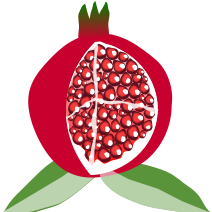

= Pomes
Duncan Dickinson <https://www.duncan.dickinson.name>
:docinfo: shared
:toc:

WARNING: This is a work in progress (and likely always will be).

:leveloffset: +1

include::{includedir}/working_papers.adoc[]

include::{includedir}/howto.adoc[]

include::{includedir}/standards.adoc[]

// include::{includedir}/software.adoc[]

include::{includedir}/glossary.adoc[]

:leveloffset: -1

== Raising ideas and critiques

This project is hosted on GitHub at
https://github.com/pomes/pomes.github.io[pomes/pomes.github.io].
Please use the Issues system to raise your ideas.

[colophon]
== Colophon

[.left.text-right]

The outer view of a pomegranate is one of intriguing form - a variety range of colours, some roughness to
the texture, and a little "crown" at the base.

Within the fruit is a spongy structure that grasps the
numerous seeds. These seeds are coated by a sweet membrane.

To me, the whole structure seemed an apt icon for discussing software systems.

_The original image was accessed from the OpenClipArt website when it was operating._
