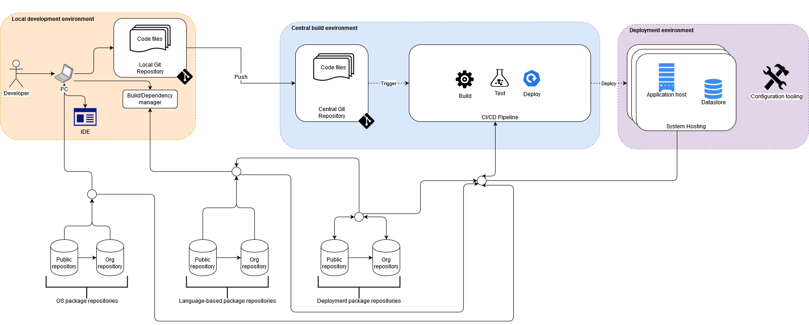

= Code flow: a partial view of the systems engineering process
Duncan Dickinson <https://www.duncan.dickinson.name>
:imagesdir: /images
:toc:

This article will focus on the delivery of a software system from a developer's local environment through to
its deployment and ongoing maintenance. The use of Open Source Software (OSS) within the software supply chain will be
a primary interest area.

== Introduction

When considering an assembly line we often conjure the image of a car or plane "factory" in which people and robots
work to bring together a tangible product. Behind the assembly line is an array of primary and secondary suppliers that
produce the components that are included in the final product - think here about seats, wheels, computer chips, wires,
steel, windows (glass) etc. The act of bringing together a car on the assembly line is only a small proportion of the
activities that are needed to produce the final product.

For most non-trivial contemporary application development projects, the software developed by the project team will draw
on a range of components in order to produce a software system. As I'll describe in this article, the team will utilise
a variety of third-party technologies that perform a variety of functions either in the end product or in its assembly.

TIP: Naturally, a project team could write their solution from scratch and not include any third-party components. However, the
work undertaken will generally use operating systems and software platforms that were not written by the team.

In the diagram below I have attempted to capture key elements across the flow of going from writing code (developing)
through to the deployment of the system into one or more environments.

.A basic flow for software production

A set of facets are highlighted in the diagram:

Local development environment:: each developer (or pair of developers) will produce code on a local machine

Central build environment:: a suite of platforms and tools that store, build, test otherwise prepare code for deployment

Deployment environment:: one or more environments into which the software system will be deployed for operation

Package repositories:: house a variety of software packages for use by various aspects of the other facets

I'll start with a general discssion of cross-cutting concerns and then explore general aspects of each facet. My goal
is to use this article as a foundation for further work and I will provide links (as appropriate) to further content by myself
and others in a hope to provide a range of information (coarse- to fine-grained) across the activity of developing software systems.

[NOTE]
.Alignment to SWEBOK knowledge areas footnote:[Refer to: P. Bourque and R.E. Fairley, eds., Guide to the Software Engineering Body of Knowledge, Version 3.0, IEEE Computer Society, 2014; www.swebok.org]
====
The discussion will centre on elements of construction, testing, maintenance, configuration managment, and engineering management.
Aspects of design will be considered but the discussion will focus on general concepts.

A number of aspects pertaining to the field of software engineering are not directly discussed: requirements and models & methods.
====

== General concepts

=== Fragility and resilience

=== Security

=== Trust

== Facets
=== Local development environment

=== Central build environment

=== Deployment environment

=== Package repositories

==== Language-based repositories

==== Operating system repositories

Most operating system (OS) distributions utilise a package manager that is used to install, update and remove
packages. Examples of

|===
|Operating system |OS Distribution |Package manager |Package format
| Linux           |Debian          |dpkg            |deb
|===

Some projects will package their software system in an OS package format that suits the OS distribution provided in the
destination deployment environment.

==== Deployment repositories

== Conclusion

This article intends to remain high-level and further work will

== Glossary

Please refer to the central link:../glossary/README.adoc[Glossary].
